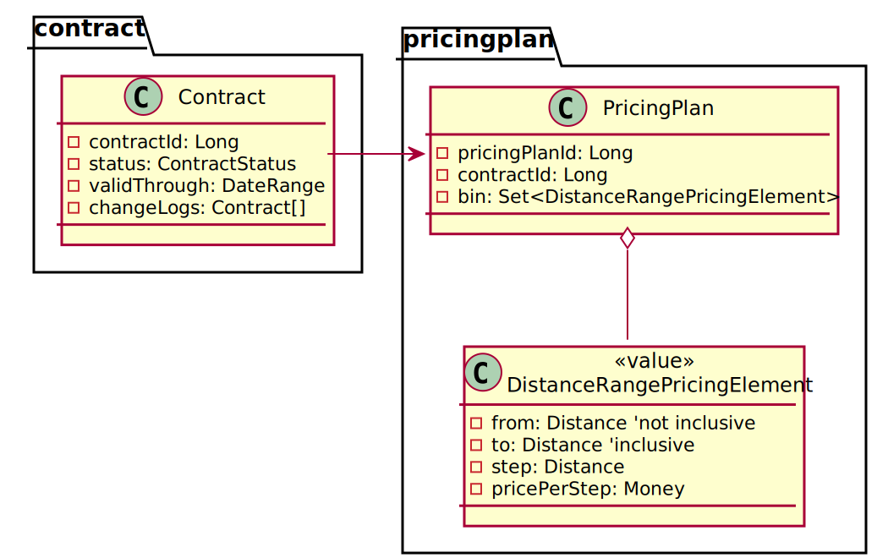

# immutableentity

불변 엔티티를 실험하기 위한 프로젝트 입니다

핵심 아이디어: **NO SQL UPDATE, ONLY INSERT**
```java
// 저장: 업데이트하지 않고 인서트
// https://github.com/appkr/immutable-entity-poc/blob/master/src/main/java/dev/appkr/immutableentity/service/ContractService.java#L44-L52
public class ContractService {
  public ContractDto updateContract(UUID contractId, ContractDto dto) {
    dto = dto.contractId(contractId); // 받은 contractId를 ContractDto에 셋팅
    dto = dto.pricingPlan(dto.getPricingPlan().contractId(contractId)); // 받은 contractId를 PricingPlanDto에 셋팅
    return createContract(dto);
  }
}
```

```java
// 조회: UUID로 조회하면서 시간 역순 정렬해서 최상위 한 개만 조회
// https://github.com/appkr/immutable-entity-poc/blob/master/src/main/java/dev/appkr/immutableentity/repository/ContractRepository.java#L13
public interface ContractRepository extends JpaRepository<Contract, Long> {
  Optional<Contract> findTopByExternalIdOrderByIdDesc(@Param("externalId") UUID externalId);
}
```



- [포스트맨 콜렉션](https://www.getpostman.com/collections/45a81ff70576c7317bc8)
- [포스트맨 환경](doc/LOCAL.postman_environment.json)

## 개발 환경
- [amazonaws corretto jdk11](https://docs.aws.amazon.com/ko_kr/corretto/latest/corretto-11-ug/what-is-corretto-11.html) 을 사용합니다
```bash
$ brew install homebrew/cask-versions/corretto11 --cask
$ jenv add /Library/Java/JavaVirtualMachines/amazon-corretto-11.jdk/Contents/Home
$ jenv versions
```
- jhipster-uaa.zip 파일 압축을 풀고 도커 이미지를 빌드합니다. 이 과정은 최초 한번만 실행하면 됩니다
```bash
~ $ cp msa-starter/jhipster-uaa.zip ./
~ $ unzip jhipster-uaa.zip && cd jhipster-uaa && ./gradlew jibDockerBuild
```
- 아래 명령으로 MySQL(3306), Kafka(9092), jhipster-uaa(9999) 등을 구동합니다
```bash
~/immutableentity $ ./gradlew clusterUp
# Ctrl + c to quit
```
- 애플리케이션을 구동합니다
```bash
~/immutableentity $ export SPRING_PROFILES_ACTIVE=local; export USER_TIMEZONE="Asia/Seoul"; ./gradlew clean bootRun
$ curl -s http://localhost:8080/management/health
```
- [Postman Collection & Environment](./postman)를 import하여 Example 및 UAA API를 작동해볼 수 있습니다

### 계정
docker service|username|password
---|---|---
mysql|root|secret

